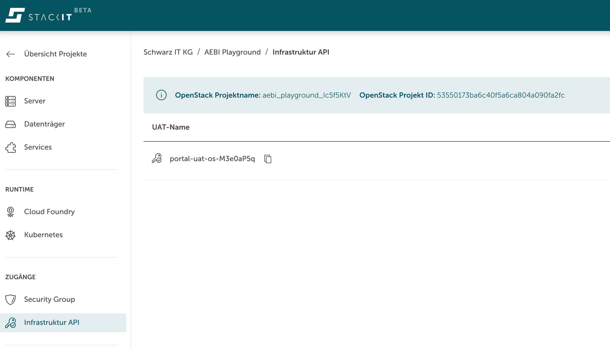
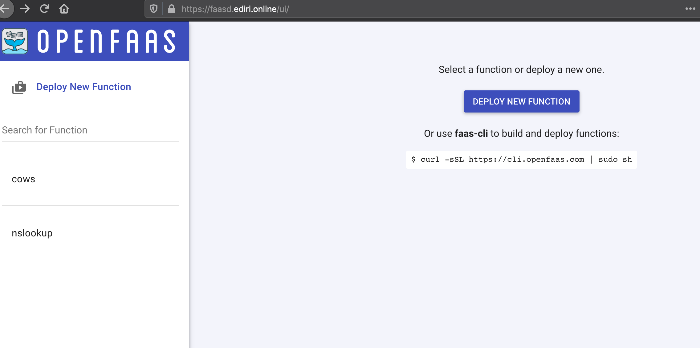

# STACKIT - Faasd


This is my take on installing faasd on [STACKIT](https://stackit.de/en/).

STACKIT is the digital brand of Schwarz IT and therefore part of the IT organisation of one of the world’s largest retail groups.
Schwarz consists of the well-known brands Lidl and Kaufland, as well as Schwarz Produktion and waste and recycling management companies.

The installation consist from following components:

- STACKIT OpenStack (https://www.openstack.org/)
- Terraform (https://www.terraform.io/)
- Azure Object Storage (https://www.terraform.io/docs/language/settings/backends/azurerm.html)
- cloud-init (https://cloudinit.readthedocs.io)
- containerd (https://containerd.io/)
- envoy (https://www.envoyproxy.io/)
- cni (https://github.com/containernetworking/cni)
- faasd (https://github.com/openfaas/faasd)
- certbot (https://certbot.eff.org/)
- ansible (https://www.ansible.com/)

# STACKIT OpenStack



At the moment, STACKIT Cloud is only available for internal use. If you are interested to use STACKIT as an early adopter, feel free to contact us (info@stackit.de).
Long story short, I just created the UAT to access the OpenStack API. And we download the `xxx-openrc.sh` file from the OpenStack UI. 

# Azure Object Storage

This step is completely optional, I just did not want to save the Terraform states in Git or store them on my local file system.

After creating the container storage on Azure, don't forget to export the `ARM_ACCESS_KEY`

    export ARM_ACCESS_KEY=xxxx

# Terraform

Read the OpenStack credentials in via:

    source xxx-openrc.sh

## variables

Please adapt the `variables.tf` for the values you need. In `datasource.tf`, I reference the floating-ip network.

## SSH key

Create in the faasd a folder called ssh. Change into the folder and create the ssh key via:

    ssh-keygen -t rsa -f ./faasd

## Terraform

### Terraform HCL
After this you can execute the terraform commands as usual:

    terraform init

    terraform plan

    terraform apply

This should create the whole infrastructure.

You should see following output:

    faasd-private = "xx.xxx.xx.xx"
    faasd-public = "yy.yy.yy.yy"

Take this ip, and create an A record in your domain.

###Terraform-CDK (Go)

Change into the `cdk` folder.

Install with Homebrew:

    $ brew install cdktf

Run `cdktf get` to generate the bindings for the providers. By default the generated Go code will be output to the generated subdirectory.

You can now deploy your CDK for Terraform application using the `cdktf deploy` command.

    cdktf deploy

You can destroy the application by running `cdktf destroy`.

    cdktf destroy

# cloud-init

In the `main.tf` we have the cloud-init file.

```
  #cloud-config
  users:
    - default

  package_update: true

  packages:
    - apt-transport-https
    - ca-certificates
    - curl
    - gnupg-agent
    - software-properties-common
    - runc

  # Enable ipv4 forwarding, required on CIS hardened machines
  write_files:
    - path: /etc/sysctl.d/enabled_ipv4_forwarding.conf
      content: |
        net.ipv4.conf.all.forwarding=1
    - path: /etc/systemd/system/envoy.service
      content: |
        [Unit]
        Description=envoy
        Documentation=https://www.envoyproxy.io/docs

        [Service]
        Type=simple
        ExecStart=/usr/bin/envoy -c /app/envoy/front-envoy.yaml
        Restart=on-failure
        RestartSec=5

        [Install]
        WantedBy=multi-user.target

  runcmd:
    - curl -sL 'https://getenvoy.io/gpg' | apt-key add -
    - apt-key fingerprint 6FF974DB | grep "5270 CEAC"
    - add-apt-repository "deb [arch=amd64] https://dl.bintray.com/tetrate/getenvoy-deb $(lsb_release -cs) stable"
    - apt update -y
    - apt install -y getenvoy-envoy

    - curl -sLSf https://github.com/containerd/containerd/releases/download/v1.5.1/containerd-1.5.1-linux-amd64.tar.gz > /tmp/containerd.tar.gz && tar -xvf /tmp/containerd.tar.gz -C /usr/local/bin/ --strip-components=1
    - curl -SLfs https://raw.githubusercontent.com/containerd/containerd/v1.5.1/containerd.service | tee /etc/systemd/system/containerd.service
    - systemctl daemon-reload && systemctl start containerd
    - systemctl enable containerd

    - mkdir -p /opt/cni/bin
    - curl -sSL https://github.com/containernetworking/plugins/releases/download/v0.9.1/cni-plugins-linux-amd64-v0.9.1.tgz | tar -xz -C /opt/cni/bin

    - mkdir -p /go/src/github.com/openfaas/
    - cd /go/src/github.com/openfaas/ && git clone --depth 1 --branch 0.11.4 https://github.com/openfaas/faasd
    - curl -fSLs "https://github.com/openfaas/faasd/releases/download/0.11.4/faasd" --output "/usr/local/bin/faasd" && chmod a+x "/usr/local/bin/faasd"
    - cd /go/src/github.com/openfaas/faasd/ && /usr/local/bin/faasd install
    - systemctl status -l containerd --no-pager
    - journalctl -u faasd-provider --no-pager
    - systemctl status -l faasd-provider --no-pager
    - systemctl status -l faasd --no-pager
    - curl -sSLf https://cli.openfaas.com | sh
    - sleep 60 && journalctl -u faasd --no-pager
    - cat /var/lib/faasd/secrets/basic-auth-password | /usr/local/bin/faas-cli login --password-stdin

```
This is the place, where the heavy lifting is going on. We start installing `envoy`, `containerd`, `cni` and `faasd` there.

# certbot

I used the certbot, to create the `Let's Encrypt` certifiacte for the envoy proxy. Just used the 

    certbot certonly --manual --preferred-challenges=dns --work-dir $PWD --logs-dir $PWD --config-dir $PWD

# ansible

At the end I use ansible, to encrypt the certs via 

    ansible-vault encrypt fullchain.pem 

    ansible-vault encrypt privkey.pem 

Keep this password safe, as you will need it during execution of the playbook.

Also, I deliver the envoy config `front-envoy.yaml` and start the `envoy` service. 

Do not forget to add your public ip address into the `hosts.yaml` file. Execute the playbook with following command:

    ansible-playbook --ask-vault-pass --private-key ssh/faasd -i ansible/hosts.yaml ansible/playbook.yaml

As we use ansible-vault, we need to provide the password. 

#the end?

If everything goes well, you should see with your DNS following page:



#the missing parts

+ monitoring
+ logging
+ better automation